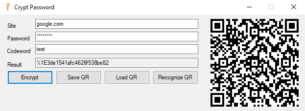

# Crypt Password

Программа, которая случайным образом по заданным параметрам создает пароли для пользователей. Она позволяет генерировать сложные пароли длинной 25 символов, содержащих латинские буквы нижнего регистра, одну букву верхнего регистра и один специальный символ - `%`. Особенность программы заключается в том, что можно запомнить кодовое слово и пароль и генерировать пароли для разных приложений и сайтов, не запоминая для каждого сайта свой пароль.

# Установка

Приложение находится в разработке, для установки приложения необходимо склонировать репозиторий к себе и скомпилировать проект с помощью `MSBuild` в терминале или через интерфейс Visual Studio.

## MSBuild

В терминале ввести:

`msbuild CryptPassword.sln -p:Configuration=Debug`

## Visual Studio

`Build -> Build Solution` или с помощью горячих клавиш `Ctrl + Shift + B`
